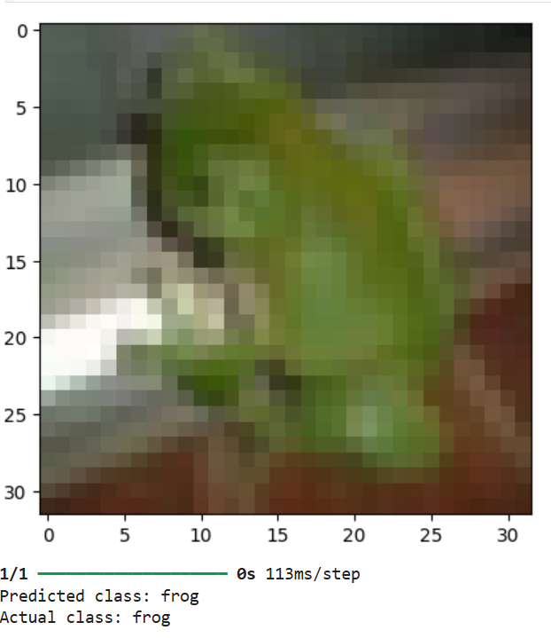

#  Image Classification using CNN (CIFAR-10)

This assignment implements an **Image Classification** model using **Convolutional Neural Networks (CNNs)** for **multiclass classification** on the **CIFAR-10** dataset.  
The model classifies images into 10 object categories such as airplanes, automobiles, birds, cats, and more.

# Dataset
- **Name:** CIFAR-10  
- **Source:** [Keras Datasets – CIFAR-10](https://www.cs.toronto.edu/~kriz/cifar.html)  
- **Description:** The dataset contains 60,000 color images (32×32 pixels) across 10 classes, with 6,000 images per class.

# Test Results

